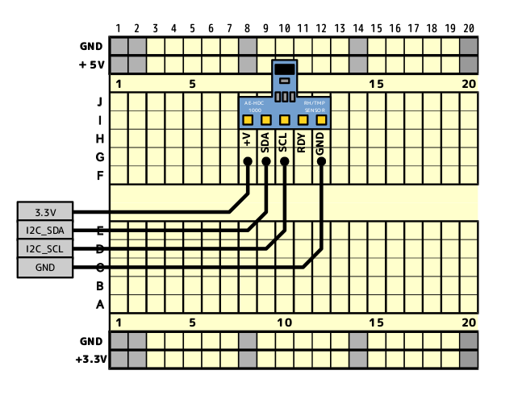

=================================================
AKI_I2C_HDC1000
=================================================

:Title: HDC1000 温湿度センサーモジュール
:Device: Edison,RaspberryPi A+,B+,2B,3B
:URL: http://akizukidenshi.com/catalog/g/gM-08775/
:PDF: http://www.ti.com/jp/lit/gpn/hdc1000
:Version: ver1.0
:BusType: I2C接続

How to use 使い方
-----------------------------------------------

::

    from akilib import AKI_I2C_HDC1000

    x = AKI_I2C_HDC1000(1)

    x.Config()

    x.Temperature()

    x.Humidity()

Date
-----------------------------------------------

:Project Title: AKI_I2C_HDC1000
:Development Date:  2016/03/12
:Development Leader: Yuta Kitagami.
:Related to library: mraa
:Version:  2016/03/12   ver1.0
